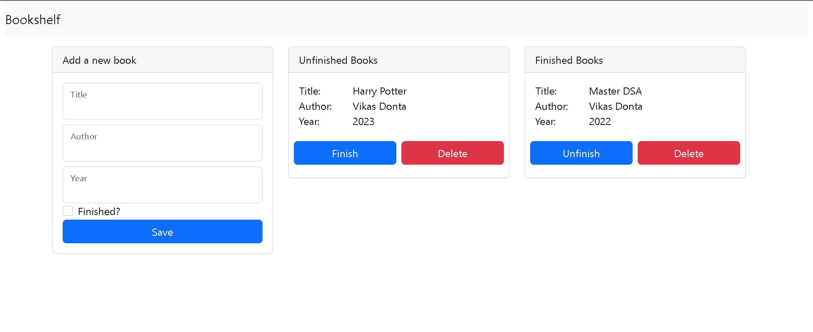

# Bookshelf App
The app that helps you track the books you have and haven't finished.

The front-end is built with React and React-Bootstrap, while the back-end is built with
Django Rest Framework.

This mono-repository is developed along with the tutorial series I wrote
"How to Build a Bookshelf App with Django and React".

# How to Run Locally

##cd backend
##pipenv install djangorestframework
##pipenv install django-cors-headers
##python manage.py runserver

##open another terminal
##cd web
##npm i
##npm run build
##npm start

##Thats it!
